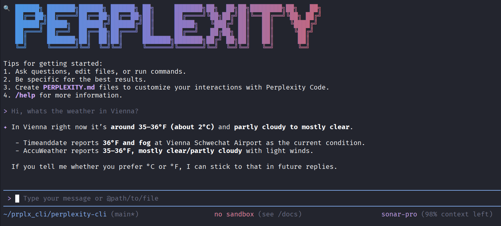
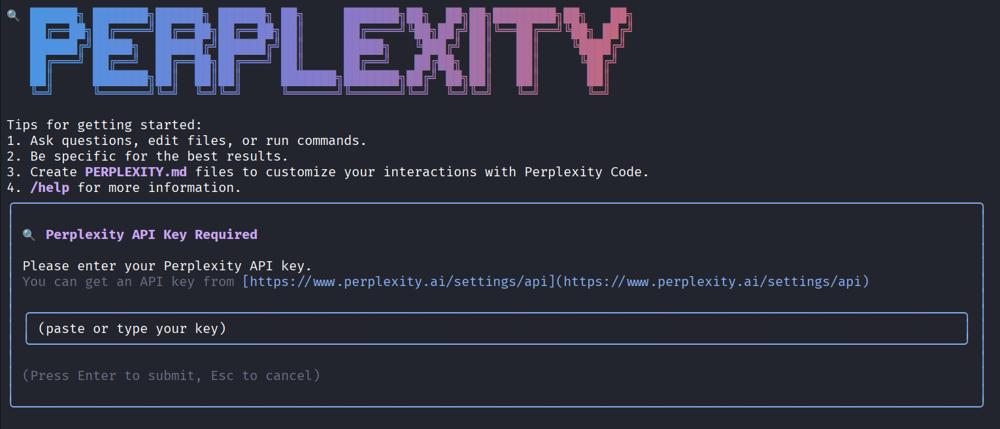

# Perplexity CLI

<!-- [](https://www.npmjs.com/package/@perplexity-cli/perplexity-cli) -->

[](https://opensource.org/licenses/Apache-2.0)
[](https://nodejs.org/)


# A command-line interface for interacting with Perplexity AI's Sonar models directly from your terminal.

## 🚀 Why Perplexity CLI?

- **🔍 AI-Powered Research**: Access to Perplexity's advanced search and reasoning capabilities
- **📚 Citation Support**: Get responses backed by real sources and citations
- **🌐 Real-Time Information**: Leverage up-to-date web search for current information
- **💡 Advanced Reasoning**: Utilize Sonar models optimized for complex analysis
- **💻 Terminal-First**: Designed for developers who live in the command line
- **🔧 Tool Integration**: Built-in web search, fetch, and multi-tool workflows

## Features

- � **Interactive Mode**: Real-time streaming responses with beautiful terminal UI
- ⚡ **Fast & Efficient**: Optimized for developer productivity
- 🎨 **Beautiful Themes**: Dark blue Perplexity theme with customizable alternatives
- 📝 **Command History**: Navigate through previous prompts with arrow keys
- 🔌 **MCP Support**: Model Context Protocol support for custom integrations
- 📊 **Citation Tracking**: View sources and citations for AI responses
- 🔄 **Checkpoint System**: Save and resume conversations

## Quick Start

### Prerequisites

- Node.js 20.0.0 or higher
- A Perplexity API key (get one at https://www.perplexity.ai/settings/api)
- macOS, Linux or Windows

### Installation

```bash
npm install -g @perplexity-cli/perplexity-cli
```

### Configuration

Set your Perplexity API key as an environment variable:

```bash
export PERPLEXITY_API_KEY=your_api_key_here
```

Or start Perplexity CLI and enter your api key there.



## Basic Usage

### Interactive mode

#### Start in current directory

```bash
perplexity
```

#### Include multiple directories

```bash
perplexity --include-directories ../lib,../docs
```

#### Use specific model

```bash
perplexity -m sonar-pro
```

### Available Models

- **sonar-pro**: Advanced model for complex reasoning and research
- **sonar**: Balanced performance for general use
- **sonar-reasoning-pro**: Precise reasoning offering Chain of Thought
- **sonar-deep-research**: Expert level research model

### Non-interactive mode for scripts

Get a simple text response:

```bash
perplexity -p "Explain the architecture of this codebase"
```

For more advanced scripting, including how to parse JSON and handle errors, use
the `--output-format json` flag to get structured output:

```bash
perplexity -p "Explain the architecture of this codebase" --output-format json
```

For real-time event streaming (useful for monitoring long-running operations),
use `--output-format stream-json` to get newline-delimited JSON events:

```bash
perplexity -p "Run tests and deploy" --output-format stream-json
```

## 📚 Documentation

### Getting Started

- [**Quickstart Guide**](./docs/cli/index.md) - Get up and running
  quickly.
- [**Authentication Setup**](./docs/cli/authentication.md) - Detailed
  auth configuration.
- [**Configuration Guide**](./docs/cli/configuration.md) - Settings and
  customization.
- [**Keyboard Shortcuts**](./docs/cli/keyboard-shortcuts.md) - Productivity
  tips.

### Core Features

- [**Commands Reference**](./docs/cli/commands.md) - All slash commands
  (`/help`, `/chat`, etc).
- [**Custom Commands**](./docs/features/custom-commands.md) - Create your own
  reusable commands.
  - [**Context Files (PERPLEXITY.md)**](./docs/cli/perplexity-md.md) - Provide persistent
    context to Perplexity CLI.
- [**Checkpointing**](./docs/features/checkpointing.md) - Save and resume
  conversations.
- [**Token Caching**](./docs/features/token-caching.md) - Optimize token usage.

### Tools & Extensions

- [**Built-in Tools Overview**](./docs/tools/index.md)
  - [File System Operations](./docs/tools/file-system.md)
  - [Shell Commands](./docs/tools/shell.md)
  - [Web Fetch & Search](./docs/tools/web-fetch.md)
- [**MCP Server Integration**](./docs/tools/mcp-server.md) - Extend with custom
  tools.
- [**Custom Extensions**](./docs/extensions/index.md) - Build and share your own
  commands.

### Advanced Topics

- [**Headless Mode (Scripting)**](./docs/features/headless.md) - Use Perplexity CLI in
  automated workflows.
- [**Architecture Overview**](./docs/development/architecture.md) - How Perplexity CLI works.
- [**IDE Integration**](./docs/ide-integration/ide-integration.md) - VS Code companion.
- [**Sandboxing & Security**](./docs/features/sandbox.md) - Safe execution
  environments.
- [**Trusted Folders**](./docs/cli/trusted-folders.md) - Control execution
  policies by folder.
- [**Telemetry & Monitoring**](./docs/development/telemetry.md) - Usage tracking.
- [**Tools API Development**](./docs/core/tools-api.md) - Create custom tools.
- [**Local development**](./docs/local-development.md) - Local development
  tooling.

### Troubleshooting & Support

- [**Troubleshooting Guide**](./docs/troubleshooting.md) - Common issues and
  solutions.
- [**FAQ**](./docs/faq.md) - Frequently asked questions.
- Use `/bug` command to report issues directly from the CLI.

### Using MCP Servers

Configure MCP servers in `~/.perplexity/settings.json` to extend Perplexity CLI with
custom tools:

```text
> @github List my open pull requests
> @slack Send a summary of today's commits to #dev channel
> @database Run a query to find inactive users
```

See the [MCP Server Integration guide](./docs/tools/mcp-server.md) for setup
instructions.

## Development

### Building from Source

```bash
# Download latest version of node
curl -o- https://raw.githubusercontent.com/nvm-sh/nvm/v0.40.3/install.sh | bash

# in lieu of restarting the shell
\. "$HOME/.nvm/nvm.sh"

# Download and install Node.js:
nvm install 24

# Clone the repository
git clone https://github.com/NoQuli/perplexity-cli.git
cd perplexity-cli

# Install dependencies
npm install

# Build
npm run build

# Run locally
npm start
```

### Running Tests

```bash
npm test
```

## Security

⚠️ **Never commit your API key to version control.** Always use environment variables or the `.env` file (which should be in `.gitignore`).

## License

Apache-2.0 License - See [LICENSE](LICENSE) for details.

## Contributing

Contributions are welcome! Please see [CONTRIBUTING.md](CONTRIBUTING.md) for guidelines.

---

Built with ❤️ using the architecture from [Gemini CLI](https://github.com/google-gemini/gemini-cli)
